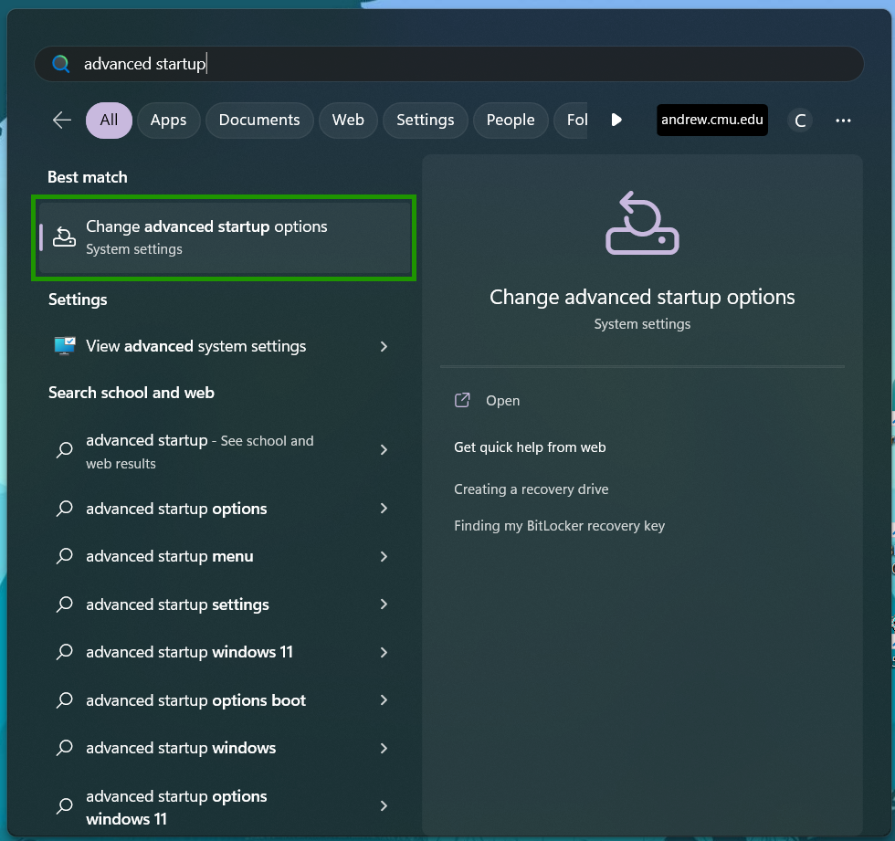
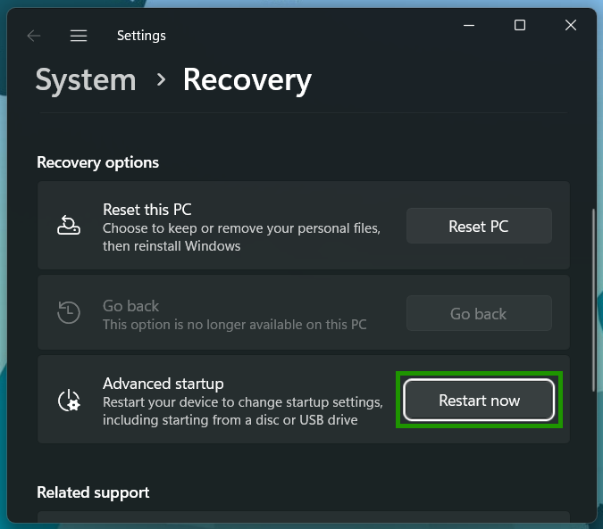

# Hardware Setup

In order to install Arch on your computer, the first thing you will need to do is __disable Secure Boot__.
Secure Boot is a feature of your most recent computers that prevents them
from running operating systems that weren't pre-approved by the manufacturer.
This will require accessing your computer's firmware settings.

## Accessing The Firmware Settings

If you are currently using Windows 10 or 11, there is a convenient way to access the firmware settings.

1. Search for "advanced startup" in the start menu.

2. Open the "Change Advanced Startup Settings" page.

3. Click the button that says "Restart Now" next to "Advanced Startup."

Because Secure Boot is a manufacturer-specific feature, the steps to disable it __depend on your specific brand of computer__. We have compiled some instructions for common computer brands:

- [HP](https://support.hp.com/us-en/document/ish_6930187-6931079-16)
- [Dell](https://www.dell.com/support/kbdoc/en-us/000133480/uefi-and-secure-boot-faqs)
- [Gigabyte](https://www.gigabyte.com/us/Support/FAQ/3001)
- [Surface](https://surfacetip.com/disable-secure-boot-surface-laptop-4/)