# Installer

Once you reboot your computer, you should see this screen for a few seconds:

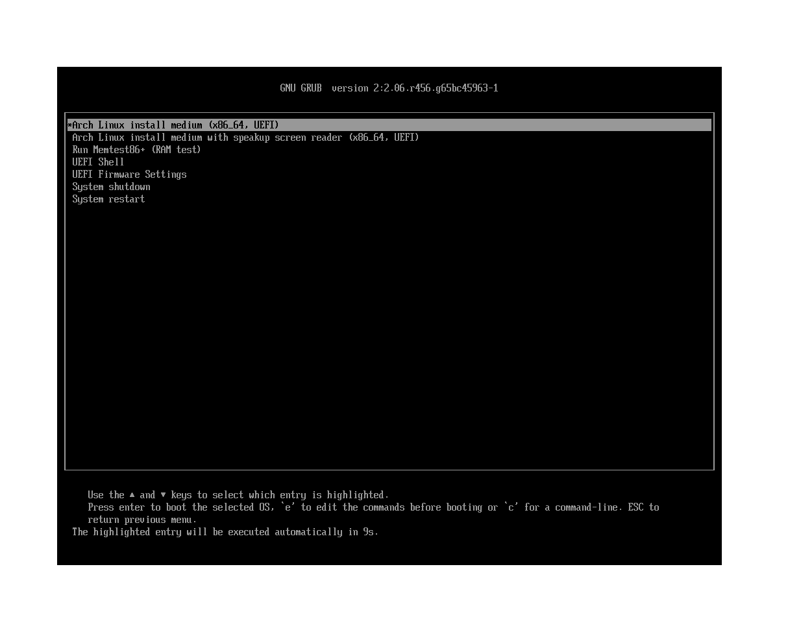
Select `Arch Linux install medium` and press enter.
This should also be the default value, so you can let GRUB automatically boot there if you'd like.

If you've booted into the live installation, you should see a splash screen like this:

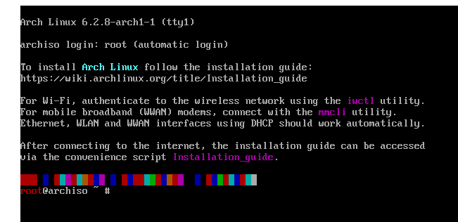

If you see this, great!
If not, try going through the previous instructions again, and if that doesn't work, have fun troubleshooting.

## Check for UEFI

Check if you're in BIOS mode or EFI mode

```
$ ls /sys/firmware/efi/efivars
```

If you see this thing, great!

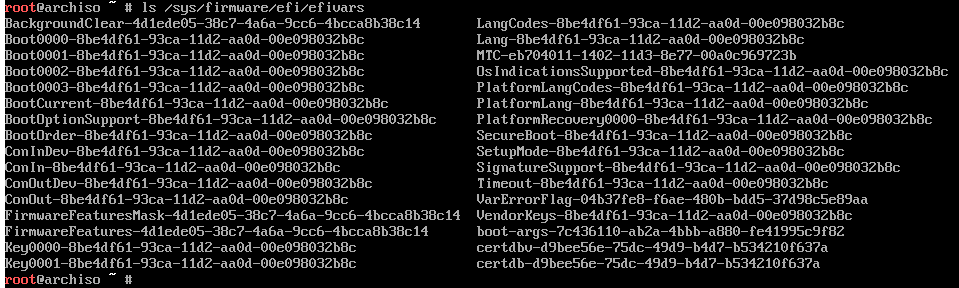

If you see this, oh no!

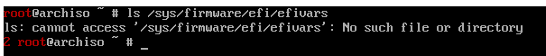

Try booting again, and look for options that indicate UEFI mode or BIOS mode.


## Connect to the Internet

If you don't have ethernet, oh no!
Anyways

Check your internet with the following commands:
```
$ ip link
$ ping www.example.com
```
The output should look like this:

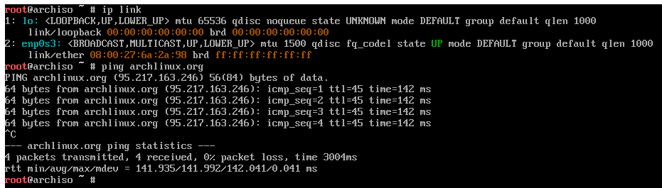

To exit `ping`, press `Ctrl-C` on your keyboard.
In general, this sends a signal to your terminal to stop whatever program is currently running, and give control back to you.


## Make sure the local time is correct


```
$ timedatectl
```

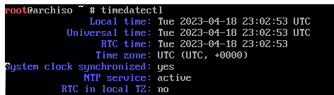

It will be in UTC by default, so don't worry if it doesn't match the time in your timezone.
We will fix that later.

## Disk Setup

Now we need to set up the disks for Arch.

To see what disks are present, run:

```
$ fdisk -l
```

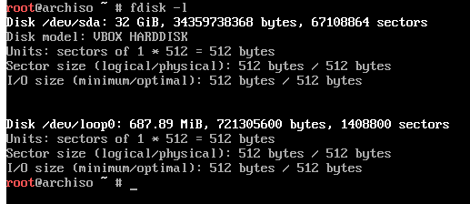

Here we see two disks: `/dev/sda` and `/dev/loop0`.
Generally, your hard drive look like `/dev/sda` or `/dev/nvme`, and should be about the correct size.
Here, `/dev/sda` is 32 gigabytes, compared to `/dev/loop0` which is only about 700 megabytes.

You will need to create a section on your disk for your root directory, `/`,
and for an EFI system partition.

```
$ fdisk /dev/whichever one is the size of your hard drive
```

This will enter the interactive disk partitioning utility, which should look something like this:

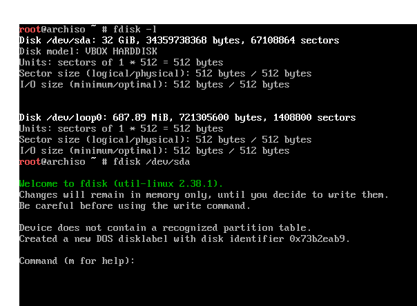


To create a new partition, you can press `n`.

You will want to create an EFI partition, so you can use the defaults until the tool asks you for the end location, where it will also provide the option to give a size instead.
Type `+512MiB` to comfortably pass the required minimum, while not overallocating space.

In total, your screen should look something like this:

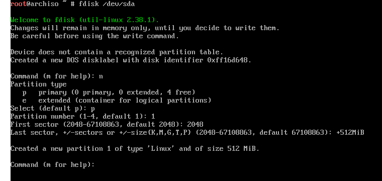

Once you've created the new partition, it will be, by default, of type `Linux`.
Since we're aiming for a partition of type `EFI`, we'll need to change the type manually.
To do this, type `t`.
Since we've only made one partition so far, the default selection should be the partition you just created.
Next, you will need the hex code for the `EFI` partition type, which in this case is `EF`.
Enter this value into the tool, and it should put you back to the `fdisk` interpreter.

To make sure this worked as you expected, you should check the partition table with `p`.

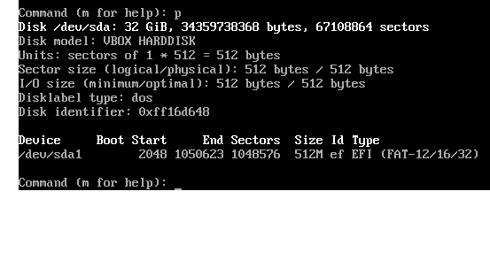

Next, we'll need to provide some `swap` space.
This follows a similar procedure:
1. Create a new partition with `n`
2. Use the defaults until the tool asks for the size of the partition, at which point you can input `1024MiB`
3. Change the type of the new partition with `t`
4. Change the type to `swap` space, which has hex value `82`

Last, we'll partition the remainder of the drive.
Again, create a new partition with `n`, and now instead of giving a small amount of space, the defaults should be to allocate the remainder of the device.

Fortunately, we don't even need to change the type of the partition, since the default is already `Linux` space.

Now, your partition table (which you can check with `p`) should look like this:

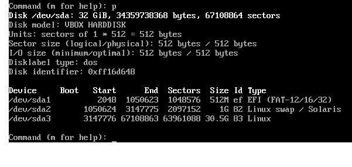

If your partitition table looks the same, with maybe a varying amount of space for the partition labelled `Linux`, then you can write these changes and exit by pressing `w`.
If you have errors on exit, `:(`

TODO: emphasize how useful fdisk -l is
We recommend writing down the names of the partitions, which you can find with `fdisk -l`, as before.

In our case, we have `/dev/sda1` as our `EFI` section, `/dev/sda2` as our `swap` section, and `/dev/sda3` as the remainder of the drive, containing most of the data.

### File System Formatting

We are unfortunately not yet done with the partitions, since we still need to format them.

First, the EFI system partition needs to use the FAT file system.

TODO: Note this
> Only format the EFI system partition if you created it during the partitioning step. If there already was an EFI system partition on disk beforehand, reformatting it can destroy the boot loaders of other installed operating systems.

```
$ mkfs.fat -F 32 /dev/efi_system_partition
```

The swap partition gets its own special format:

```
$ mkswap /dev/swap_partition
```

And then finally, your root directory can use EXT4,
which is a fairly common kind of file system on Linux.

```
$ mkfs.ext4 /dev/root_partition
```

### Mounting the File System

Now that we have a file system, we need to actually expose it as a directory on our machine.

```
$ mount /dev/root_partition /mnt
```

This command "mounts" the root partition we created earlier so that its contents
are accessible at the path `/mnt`.

> Run mount(8) with the --mkdir option to create the specified mount point. Alternatively, create it using mkdir(1) beforehand.

```
$ mount --mkdir /dev/efi_system_partition /mnt/boot
```

This places the EFI system partition at a directory called `boot`
inside of our root directory. Later, we will set up a bootloader
that will search for this directory and use it to boot the operating system.

Finally, let's make sure our swap partition is actually enabled:

```
$ swapon /dev/swap_partition
```

## Installation Installation

Packages to be installed must be downloaded from mirror servers,
which are defined in /etc/pacman.d/mirrorlist.
On the live system, after connecting to the internet,
reflector updates the mirror list by choosing
20 most recently synchronized HTTPS mirrors and sorting them by download rate.

Mirror list is ok by default

Now that all of our directories are set up,
we can... actually install the operating system to our disk!

```
$ pacstrap -K /mnt base linux linux-firmware
```

Because Arch is so customizable, this command really does only install the kernel itself.
To actually use the system, you'll need some common tools.

```
$ pacstrap -K /mnt e2fsprogs vim nano man-db man-pages texinfo dhcpcd inetutils net-tools sudo vi
```

TODO: If you ever want to log in to wifi, oh no
TODO: drivers???

## Setting the File Systems Table (fstab)

If we want our root and boot directory to actually be mounted when we start the system,
we will have to create a file that tells the bootloader to mount them.

```
$ genfstab -U /mnt >> /mnt/etc/fstab
```

Now, our system is functional enough to actually be used for commands.
This command switches our root directory from the live installer to our newly installed system.

```
$ arch-chroot /mnt
```

The terminal should look slightly different after you run this command:

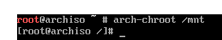

### Setting the Timezone

Now we can actually set the correct time zone, as we promised earlier.

```
$ ln -sf /usr/share/zoneinfo/Region/City /etc/localtime
```

To see what the valid regions are, type in just the part up to `/usr/share/zoneinfo/`,
and then hit tab twice. It will list several available regions for you to use.
For example, the command to set EST as your timezone looks like:

```
$ ln -sf /usr/share/zoneinfo/America/New_York /etc/localtime
```

Then, we have to tell the system that we have updated the timezone.

```
$ hwclock --systohc
```

To double check that the time is correct, run `date`.
You should now see your correct local time!

### Setting the locale

```
$ vim /etc/locale.gen
```
Search for `en_US.UTF-8` in vim by typing `/` and then `en_US.UTF-8`, and finally press the escape key once you've found the line.
Vim should automatically find that text in the file.
To uncomment this, move the cursor left with either the left arrow key or by pressing `h`.
Once the cursor is hovering over `#`, press `x` to delete it, thereby uncommenting the line.
To exit `vim`, simply type `:wq` and press enter.

```
$ locale-gen
```

```
$ echo "LANG=en_US.UTF-8" > /etc/locale.conf
```

### Network Time


pick a cool name for your computer
something truly radical
something totally tubular
and then

no spaces
no special characters either
preferably just letters
(capital letters and numbers are ok)

```
$ echo "notcringename" > /etc/hostname
```

Once you've set your hostname, try accessing the internet with `ping`:
```
$ ping www.example.com
```

if it doesn't work, good luck!

### Set a root password

To install new programs or edit system files, you will need a password.
Currently, there is no password set, which means you could
accidentally change anything at any time which is bad.

Set a password.

```
$ passwd
```

Note that when typing in the password, you won't see anything appear on the screen.
This is just to make sure that anyone watching won't see your password.

### Install the Bootloader

```
$ pacman -S grub efibootmgr
```
efibootmgr is used by the GRUB installation script to write boot entries to NVRAM.

```
grub-install --target=x86_64-efi --efi-directory=/boot --bootloader-id=GRUB
```

There should be a message saying that the install was successful,
and you should be able to run `ls /boot/grub` and see some miscellaneous files there.
If not, good luck!

```
$ grub-mkconfig -o /boot/grub/grub.cfg
```

if you have done alllll of the preceeding steps correctly, now do

```
$ exit
$ umount -R /mnt
$ shutdown now
```

Now, remove the flash drive and turn your computer back on.

If you see GRUB:

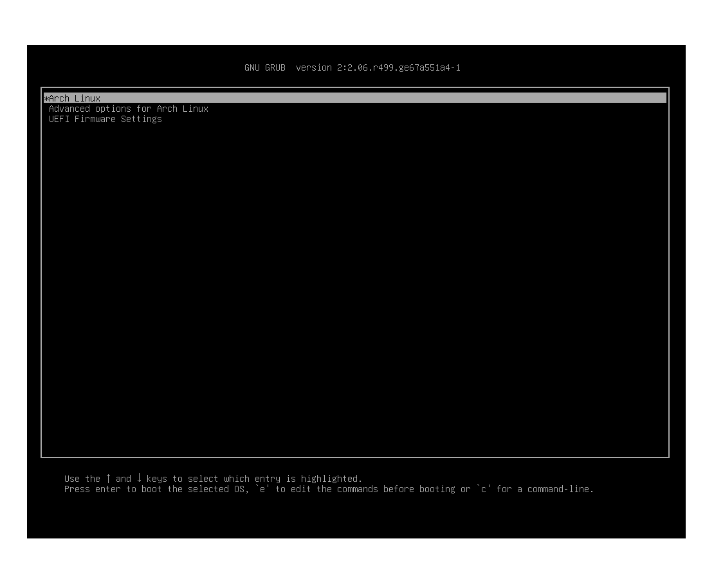

That's good. If you hit enter, and you see this:

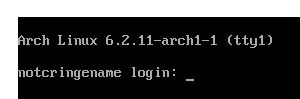

then (probably) everything worked!!

You can log in with username `root` and the password you set earlier.
