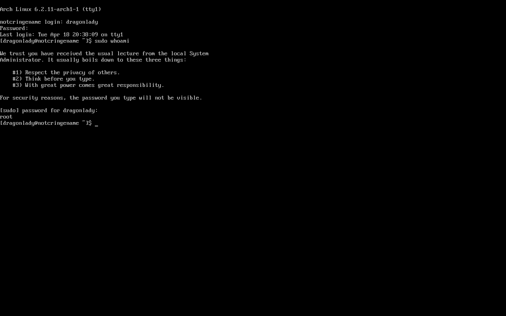
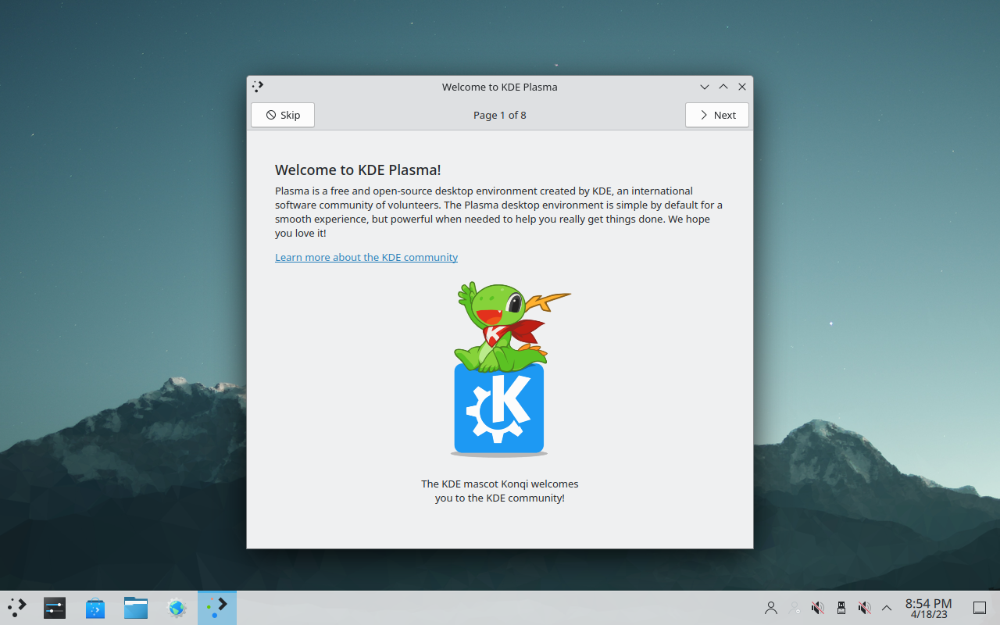

# Using the OS

Congratulations, you have installed Arch!
Before you start exploring on your own, we have a few important steps.

## 1 Make a non-root user

The default user is `root`, which has all permissions at all times.
This means that it's easy to accidentally break your install by running the wrong command,
and is also a security risk.
To fix this, you can create your own user account using the `useradd` command.

```
$ useradd -m dragonlady
$ passwd dragonlady
```

As a reminder, when you type in your password, you will not see anything appear on screen.

### 1.1 Add yourself as a "sudoer"

By default, normal user accounts cannot do things like install software or change system files.
To temporarily give yourself higher permissions, you can use the `sudo` command.
To give your account access to the `sudo` command, you need to add yourself to the following file.

```
$ EDITOR=nano visudo
```

In nano, press Ctrl-w and then type `root ALL` to find the line containing the entry for the root user.
Directly below it, add the following line, substituting in whatever username you picked:

```
dragonlady ALL=(ALL:ALL) ALL
```

Once that's done, you can logout using the `logout` command and log back in as your new account.
Now, you can try running the following commands to make sure it worked:

```
$ whoami
$ sudo whoami
```

The first command should print out your username.
The second command will ask you for your password, and then print out `root`.



## 2 Enable Networking

To tell Arch to enable the networking service on startup, we can use `systemctl enable`.
If we rebooted the machine, it would start working on the next login.
However, we can tell Arch to start running the service immediately using `systemctl start`.

```
$ sudo systemctl enable dhcpcd.service
$ sudo systemctl start dhcpcd.service
$ ping www.example.com
```

> Reminder: you can press Ctrl-c to stop ping once you see a few successful packets.

## Installing packages

Now that you have an internet connection and the `sudo` command,
you could try installing some new software.
Most Linux distributions have a program called a package manager
that allows you to install, uninstall, and update software.
The package manager for Arch is called `pacman`.
To install packages, use the following command:

```
$ pacman -S package_to_install anotherpackage aThirdPackage
```

This system is very powerful:
even adding an entire windowed desktop environment can be done
just by installing some packages with `pacman`,
as you will see in the following step.

## Desktop Environment

While the command line is one of the most versatile tools
a Linux user has, graphical interfaces are still useful for a wide variety of tasks.
There are several different desktop environments you could pick from,
but we have found the simplest option to be using KDE Plasma with XOrg.

```
$ sudo pacman -S xorg-server xorg-apps xorg-xinit xterm xorg-fonts-100dpi xorg-fonts-75dpi autorandr
$ sudo pacman -S sddm plasma kde-applications plasma-nm ttf-dejavu ttf-liberation sddm
```

If all of the packages install successfully,
then all you need to do to enable your new desktop environment is start the service:

```
$ sudo systemctl enable sddm
$ sudo systemctl start sddm
```

